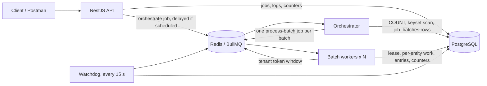
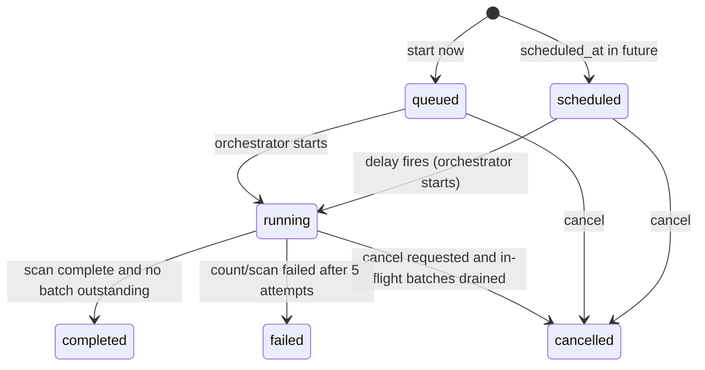
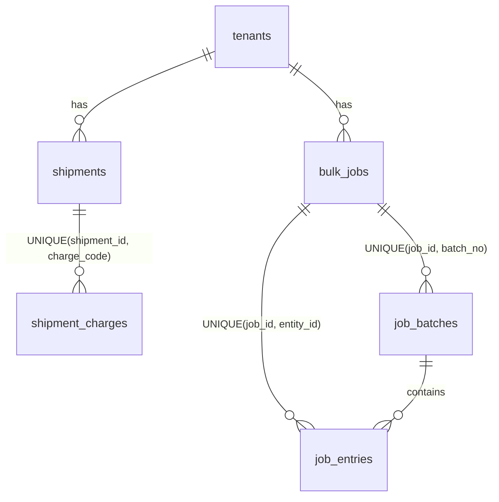

# Architecture

## Processes



One Docker image runs as two processes:
- **`api`** (`dist/main.js`) validates and records jobs, and enqueues orchestration.
- **`worker`** (`dist/worker.js`) runs the orchestrator, batch and watchdog consumers. Add replicas to scale.

The API never processes entities, except in **combined mode** (`RUN_WORKERS_IN_API=true`). There, the API process also loads the same queue consumers. It's used for single-service hosting such as Render's free plan (see [DEPLOYMENT.md](DEPLOYMENT.md)). The code paths and guarantees are identical.

**Observability:**
- `GET /v1/bulk-jobs/{id}` returns the job, progress, ETA, batches by status and tenant rate usage.
- `GET /v1/bulk-jobs/{id}/events` streams the same data as Server-Sent Events until the job ends.
- `/summary` groups the failure and skip reasons; `/entries` is the per-entity log.
- Interactive API docs are at `/docs` (Swagger).

**Postgres is the source of truth** for every job, batch, log entry and side effect. Redis holds only work that can be rebuilt from Postgres: queued, delayed and active BullMQ jobs, plus the rate-limit window. The watchdog reconciles the two.

## Job lifecycle



Every status change is a conditional `UPDATE … WHERE status IN (…)`. That means a race between cancel and start, or between two finalisers, resolves to exactly one winner, and a terminal state is never overwritten.

## The plugin model: why the second action cost nothing

The engine in `src/bulk-engine/` imports nothing from shipments. It only knows two interfaces.

```ts
interface EntityAdapter<T> {                  // how to read an entity type
  entityType: string;
  validateFilter(filter): string[];
  count(tenantId, filter): Promise<number>;
  scanPage(tenantId, filter, afterId, limit): Promise<bigint[]>;   // ids only
  lockByIds(tx, ids): Promise<T[]>;                                 // SELECT … FOR UPDATE, id order
  matchesFilter(entity, tenantId, filter): boolean;
  entityId(e): bigint;  entityRef(e): string;
}

interface BulkAction<P> {                     // what to do to one entity
  actionType: string; entityType: string;
  validateParams(params): string[];
  execute(entity, params: P, ctx: { jobId, tenantId, batchId, tx }): Promise<{ outcome, reason? }>;
}
```

[`ShipmentModule`](../src/actions/shipment.module.ts) registers one adapter and two actions into the `AdapterRegistry` and `ActionRegistry` when it starts. The API validates a request by looking up `entity_type:action_type`, and the batch processor dispatches the same way. Nothing checks `if (action === …)`.

`transition_status` needed:
- `status-machine.ts` (20 lines);
- `TransitionStatusAction` (about 40 lines);
- one `register()` line.

**No engine file changed to support it.** A new entity, such as Invoice, needs an `InvoiceAdapter`, its actions, and an `InvoiceModule` added to `CoreModule`. Orchestration, batching, leasing, logging, counters, progress, cancellation, rate limiting and idempotency are all reused unchanged.

## Orchestrator (one run per job)

1. Load the job. If it's terminal, stop. If cancel was requested, finalise and stop.
2. Move it from `scheduled`/`queued` to `running` with a conditional update, so a concurrent cancel wins.
3. If `total_matched` is null, run `adapter.count()` and save it.
4. Loop through pages of `BATCH_SIZE` ids:
   - re-check for cancellation;
   - `scanPage(afterId)`;
   - **upsert** the `job_batches` row on `(job_id, batch_no)` with its frozen `entity_ids`;
   - enqueue `process-batch` with a deterministic BullMQ id `b-<job>-<batchNo>`;
   - **then** advance `cursor_after_id` and `next_batch_no`.

   Enqueueing before advancing the cursor means a crash anywhere replays the same page into the same batch row and the same queue id. There are no gaps and no duplicates.
5. Set `scan_complete` and reconcile `total_matched` to the sum of the batch sizes, since rows can change between the count and the scan. Then try to finalise.

## Batch processor: the exactly-once core

```
pre-check  batch done/cancelled → ack;  job cancelled/terminal → close batch, ack
rate limit acquire(tenant, n) in Redis → if refused: moveToDelayed(retryAfter) — never fail/drop
claim      UPDATE job_batches SET status='leased', lease_owner=<token>, attempt_count+1
           WHERE id=$1 AND (status='pending' OR (status='leased' AND leased_at < now()-TTL))
           → 0 rows & batch still leased by a live worker → delay 5 s and retry (do NOT ack)
BEGIN
  skip ids that already have a job_entries row for this job      (resume after a committed attempt)
  SELECT … FOR UPDATE the entities, ordered by id                 (no lost updates, no deadlocks)
  for each entity:
    every CANCEL_CHECK_EVERY: cancel requested? → stop, batch = 'cancelled'
    gone → skipped/entity_not_found;  filter no longer matches → skipped/no_longer_matches_filter
    SAVEPOINT; action.execute(); RELEASE      (throws → ROLLBACK TO SAVEPOINT, failed/unexpected_error)
  INSERT job_entries (all), UPDATE bulk_jobs counters (once)
  UPDATE job_batches SET status='done' WHERE id=$1 AND lease_owner=<token>   ← fencing
  0 rows → throw → ROLLBACK the whole batch (someone stole our expired lease)
COMMIT
finalise job if nothing is outstanding
```

**Why a charge is never applied twice:**

| Failure | What protects it |
|---|---|
| Worker dies before commit | Nothing of the batch persisted. The lease expires and the batch is re-claimed and re-run in full. |
| Worker dies after commit | The batch is `done`, so every redelivery acks immediately. |
| Slow worker whose lease was stolen | Its commit fails the fencing check and rolls back. Only the new owner's work persists. |
| Two jobs charging the same shipment | The row lock serialises them. The action checks for an existing `(shipment_id, charge_code)` → `skipped`. `INSERT … ON CONFLICT DO NOTHING` is the final backstop, and it never raises an error, so it can't abort the batch transaction. |
| Anything else | `UNIQUE(job_id, entity_id)` on `job_entries` means an entity can only be logged, and counted, once per job. |

## Watchdog (repeatable job, every 15 s, one run at a time)

1. `leased` batches with an expired TTL go back to `pending`.
2. `pending` batches of running jobs whose BullMQ job is gone, completed or failed are re-enqueued under a fresh id. It rotates by `checked_at`, so a large backlog of rate-limited batches can't starve the check.
3. Scheduled or queued jobs that are past due, or running jobs whose scan has stalled, get their orchestration re-enqueued if the BullMQ job is gone.
4. Running jobs with nothing outstanding are finalised.

## Rate limiting

A per-tenant sorted set holds members `<uuid>:<count>`, scored by grant time from the Redis `TIME` command. A Lua script, which runs atomically:
- drops members older than 60 s;
- sums the counts;
- grants if `used + n ≤ limit`;
- otherwise returns the milliseconds until enough of the window expires.

The batch is re-delayed by exactly that amount, plus jitter. This is a **strict** "no more than N in any 60 s" rule. It counts entities, and it covers all of a tenant's jobs and all workers. The measured behaviour is in [TESTING.md](TESTING.md) and the README.

## Schema



| Table | Key columns and indexes |
|---|---|
| `shipments` | `BIGSERIAL id` (the keyset cursor), `UNIQUE(tenant_id, shipment_no)`. Indexes `(tenant_id, origin_port, status, id)`, `(tenant_id, status, id)` and `(tenant_id, destination_port, id)` match the demo filters and support the ordered scan. Beyond the PDF's fields it adds `tenant_id`, `billing_currency` (the FX target) and `is_billed`. |
| `shipment_charges` | Charge lines as rows, not a JSON array, so the uniqueness rule is real. Stores rate, source amount and currency, `fx_rate`, `amount_billing`, and `bulk_job_id` for audit. |
| `fx_rates` | `UNIQUE(base_currency, quote_currency)` |
| `bulk_jobs` | Filter and params as JSONB (snapshotted at creation), status and timestamps, `total_matched`, the counters, the orchestrator cursor (`cursor_after_id`, `next_batch_no`, `scan_complete`), and `UNIQUE(tenant_id, idempotency_key)` with a `request_hash`. |
| `job_batches` | `entity_ids BIGINT[]`, bounds, status (`pending`/`leased`/`done`/`cancelled`), the lease (`leased_at`, `lease_owner`, `attempt_count`), and `queue_job_id`/`checked_at` for the watchdog. |
| `job_entries` | The per-entity log: outcome, reason, `entity_ref` (the shipment number). Index `(job_id, outcome, id)` supports the filtered, paginated log. |
